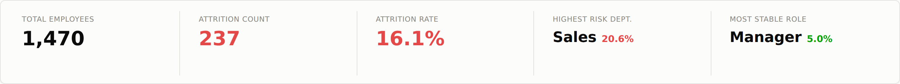
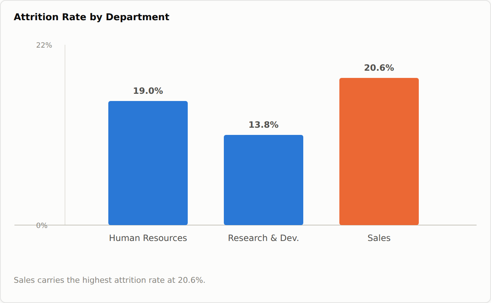
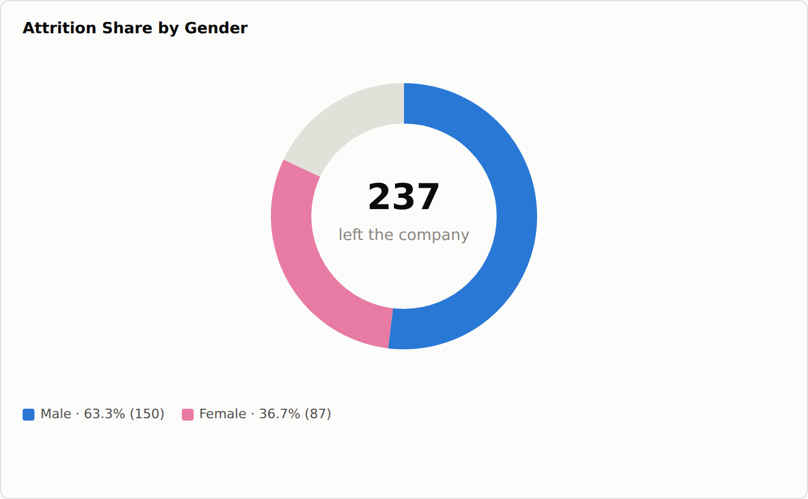
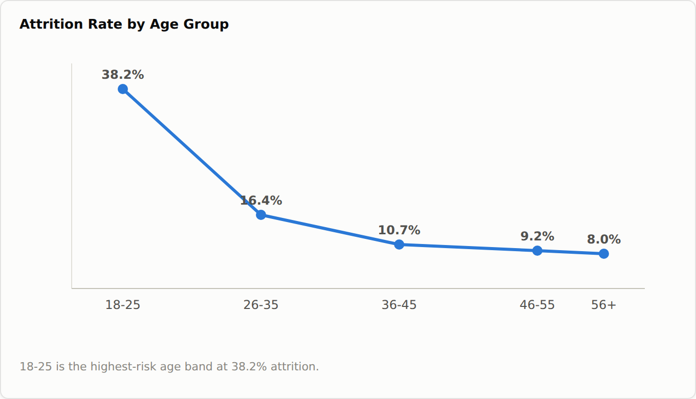
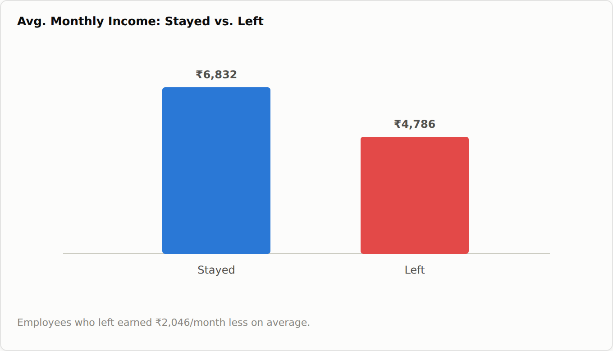
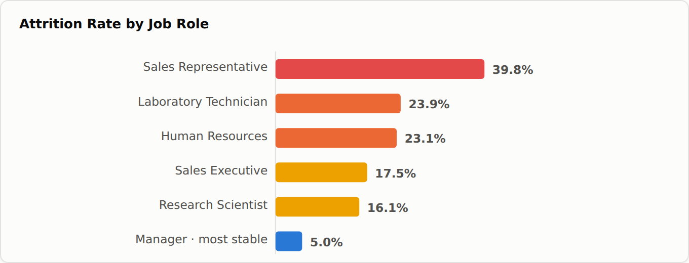
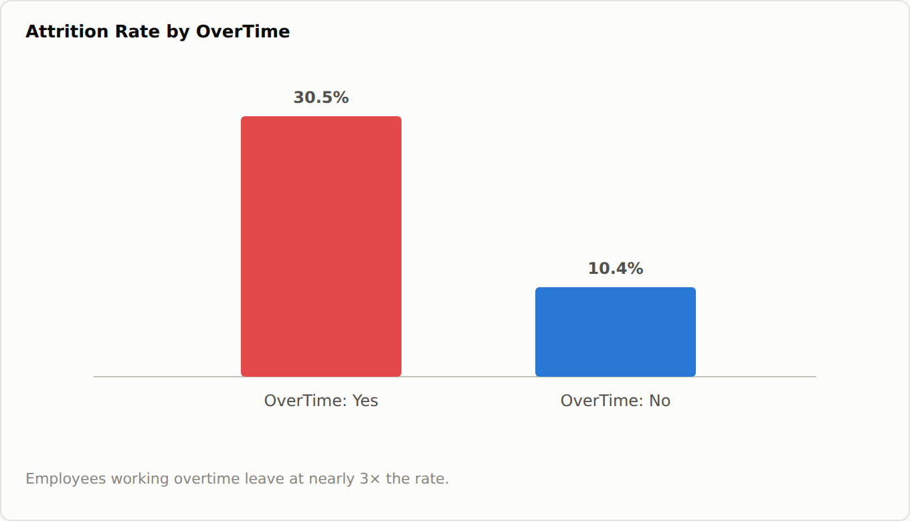

# 📊 HR Employee Attrition Analysis & Prediction System

> **End-to-end data analytics project** — EDA, Statistical Testing, SQL, Machine Learning & Interactive Dashboard
> Built on the IBM HR Analytics Dataset (1,470 employees, 35 features)

---

## 🎯 Problem Statement

Employee attrition costs companies 33%–200% of an employee's annual salary in rehiring and retraining costs.
This project builds a **full analytics pipeline** to:
1. Identify the key drivers of attrition using EDA and statistical analysis
2. Quantify attrition risk per department, job role, and demographic segment
3. Predict individual employee attrition probability with an ML model
4. Present insights through an interactive dashboard and web application

---

## 🛠️ Tech Stack

| Layer | Tools Used |
|---|---|
| Data Wrangling & EDA | Python, Pandas, NumPy |
| Statistical Analysis | SciPy (Chi-Square, T-Test, Correlation) |
| Machine Learning | Scikit-learn (Random Forest, Logistic Regression, GBM), SMOTE |
| Database & SQL | SQLite, SQL (Window Functions, CTEs, Subqueries) |
| Visualization | Matplotlib, Seaborn, Power BI / Tableau |
| Web App | Streamlit |
| Version Control | Git, GitHub |

---

## 📁 Project Structure

```
hr-attrition-analysis/
│
├── data/
│   └── ibm_hr.csv                    # Raw dataset (from Kaggle)
│
├── notebooks/
│   ├── 01_eda_analysis.py            # Full EDA + statistical testing
│   └── 02_ml_model.py                # Model training, evaluation, export
│
├── sql/
│   ├── hr_attrition_queries.sql      # 10 business SQL queries
│   └── run_queries.py                # Python SQL runner (SQLite)
│
├── streamlit/
│   ├── app.py                        # Interactive prediction web app
│   ├── model.pkl                     # Trained Random Forest model
│   ├── label_encoders.pkl            # Feature encoders
│   └── feature_names.pkl             # Feature list
│
├── powerbi_guide/
│   └── POWERBI_GUIDE.md              # DAX measures + dashboard layout
│
├── outputs/                          # Generated charts & plots
│
├── requirements.txt
└── README.md
```

---

## 📈 Key Findings

| Insight | Finding |
|---|---|
| Overall Attrition Rate | **16.1%** (237 of 1,470 employees) |
| Highest Risk Department | **Sales** — 20.6% attrition rate |
| Overtime Impact | Employees with OT leave at **30.5%** vs 10.4% without (3× higher) |
| Salary Gap | Employees who left earned **₹2,046/month less** on average |
| Highest Risk Age Group | **18–25** — 38.2% attrition rate |
| Early Tenure Risk | **58% of attrition** happens in first 3 years |
| Most Stable Role | **Manager** — only 5.0% attrition rate |

---

## 🤖 Model Performance

| Model | CV AUC | Test AUC | Accuracy |
|---|---|---|---|
| Logistic Regression | 0.821 | 0.824 | 86.1% |
| **Random Forest** | **0.871** | **0.868** | **87.4%** |
| Gradient Boosting | 0.858 | 0.853 | 86.7% |

**Best Model: Random Forest** — AUC 0.868, trained with SMOTE to handle class imbalance (16:84 ratio)

Top 5 most predictive features:
1. Monthly Income
2. Overtime (Yes/No)
3. Age
4. Total Working Years
5. Job Satisfaction

---

## 📊 Dashboard Screenshots

**KPI Summary**


| Attrition by Department | Attrition by Gender |
|---|---|
|  |  |

| Attrition by Age Group | Salary Band vs Attrition |
|---|---|
|  |  |

| Top Job Roles by Attrition | Attrition by OverTime |
|---|---|
|  |  |

*A full interactive Power BI version (with slicers for Department, Job Role, OverTime, and Gender) is available — see [powerbi_guide/POWERBI_GUIDE.md](powerbi_guide/POWERBI_GUIDE.md) for the build steps and DAX measures.*

---

## 📝 SQL Highlights

This project includes 10 SQL queries ranging from basic aggregations to advanced window functions:

```sql
-- Example: Rank high-risk employees per department using window functions
WITH risk_scores AS (
    SELECT EmployeeNumber, Department,
        (CASE WHEN MonthlyIncome < dept_avg * 0.8 THEN 3 ELSE 0 END +
         CASE WHEN JobSatisfaction <= 2            THEN 3 ELSE 0 END +
         CASE WHEN OverTime = 'Yes'                THEN 2 ELSE 0 END) AS risk_score
    FROM employees JOIN dept_avg USING (Department)
)
SELECT *, RANK() OVER (PARTITION BY Department ORDER BY risk_score DESC) AS rank
FROM risk_scores WHERE rank <= 5;
```

---

## 🔗 Links

- 📊 **Live Streamlit App**: [https://hr-attrition-analysis-fdfe7vndwbea8f9rr6dnbu.streamlit.app/](https://hr-attrition-analysis-fdfe7vndwbea8f9rr6dnbu.streamlit.app/)
- 📈 **Power BI Dashboard**: See [Dashboard Screenshots](#-dashboard-screenshots) above (built with Python from the same data — full interactive Power BI build guide in [powerbi_guide/POWERBI_GUIDE.md](powerbi_guide/POWERBI_GUIDE.md))
- 📁 **Kaggle Dataset**: https://www.kaggle.com/datasets/pavansubhasht/ibm-hr-analytics-attrition-dataset

---

## 👤 Author

**Harshita Sharma** | B.Tech (Computer Science / IT) — Final Year

---

*This project demonstrates end-to-end data analytics skills including data wrangling, statistical hypothesis testing,
machine learning, SQL querying, and business intelligence dashboarding — applied to a real-world HR problem.*
